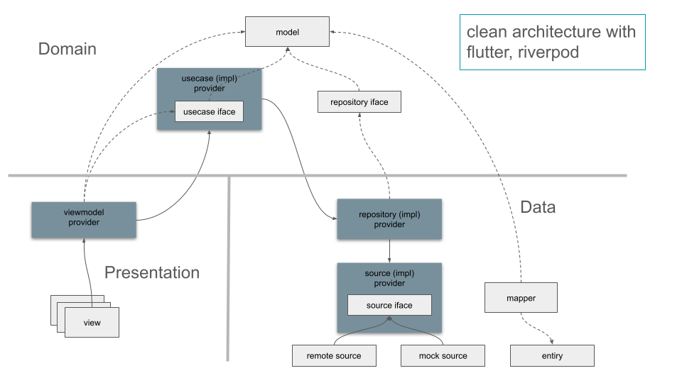

# clean Architectur with Flutter and riverpod

## SW 생명주기 관점에서 좋은 Architecture 
계층적 구분으로 설계를 단순화하고, 개발시 협업 효과를 높이고 코드간 결합도를 낮춰 서로 독립적으로 개발을 진행할 수 있어야 합니다. 그리고 유지보수시 대응력을 높일 수 있어야 합니다.

## Clean Architecture
domain, data, presentation layers 구조로 구분합니다.
  * ### domain
    data model과 biz logic을 정의하며 data, presentation layer의 구현에 의존하지 않습니다.
  * ### data
    domain layer가 정의한 추상화된 인터페이스를 통해 domain에게 data 입출력 기능을 제공합니다.
  * ### presentation
    이용자가 접하는 S/W의 Ux를 구현하며, 특정 UI는 domain이 제공하는 model에 종속됩니다. 즉, domain의 data model이나 biz logic에서 일어나는 이벤트들에 반응하여 UI를 변경합니다.

## Flutter(Dart), Riverpod
하위계층이 상위계층에 의존성을 갖도록 하는 구조는 상태관리 패키지 riverpod을 사용합니다.

하위계층이 상위계층에 종속된다는 의미는 상위계층이 정의한 Interface를 하위계층이 Implememtation해야함으로 의미합니다. 이렇게 함으로써 상위계층은 하위계층에서 개발하는 구현내용으로부터 독립적으로 개발이 가능하게 됩니다.

예를들어, domain layer에서 Biz logics(usecase들)을 개발할 때, 자신이 정의한 Interface를 활용하여 코딩하게 되며 data 계층은 data가 어떤 방식으로 입출입되는지 관계없이 코드를 유지할 수 있습니다.
마찬가지로 presentation 계층에서 일어나는 사용자 UI 조작에서 일어나는 이벤트에 대해 사전에 domain이 정의한 usecase interface를 구현한 controller를 통하게 되므로 Biz logic은 view 구현으로 부터 독립됩니다. 

이렇게 dart의 추상클래스를 통한 Interface와 Riverpod이 제공하는 Dependency binding 기능을 통해 domain, data, presentation 계층의 코드들이 독립적으로 유지되고 presentation, data 계층과 domain 계층간 의존성 원칙(dependency rules)이 지켜지게 됩니다.